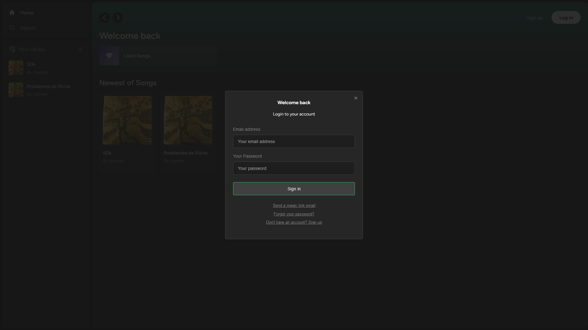
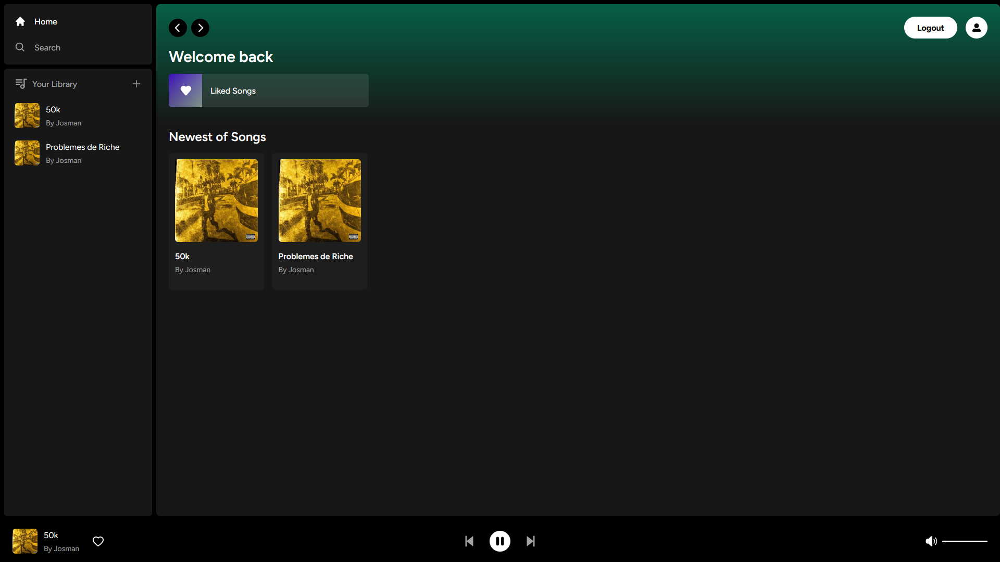
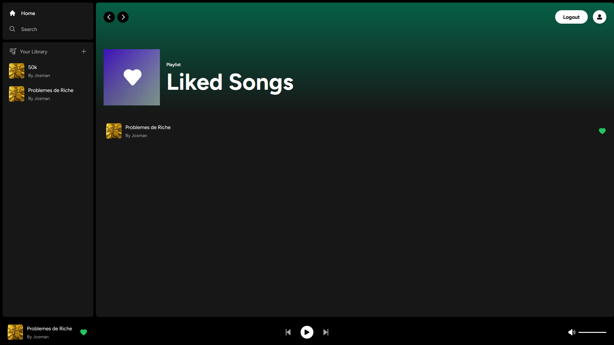
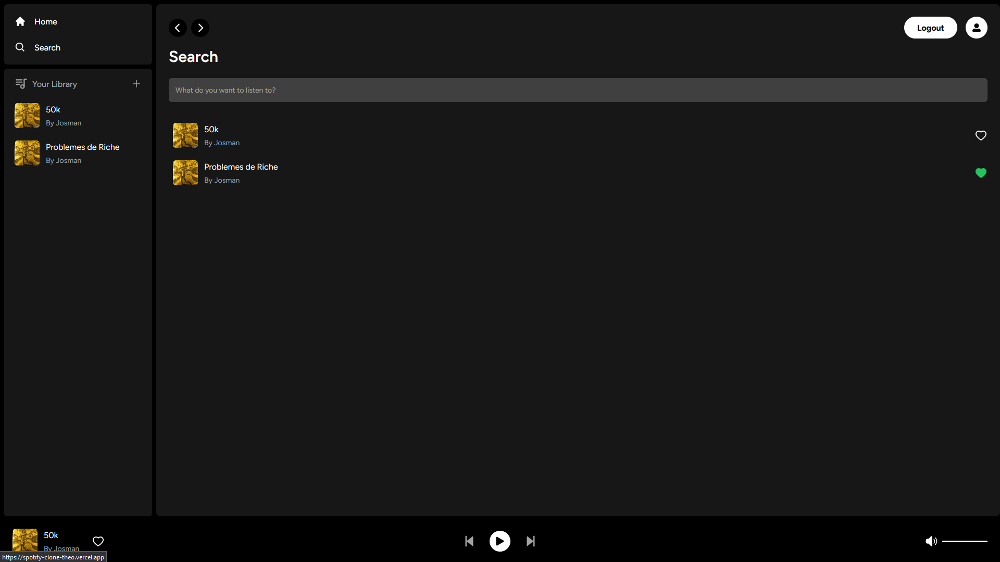
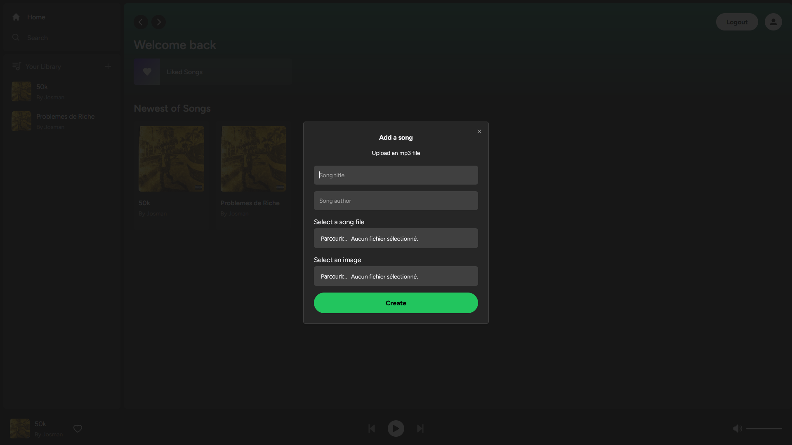
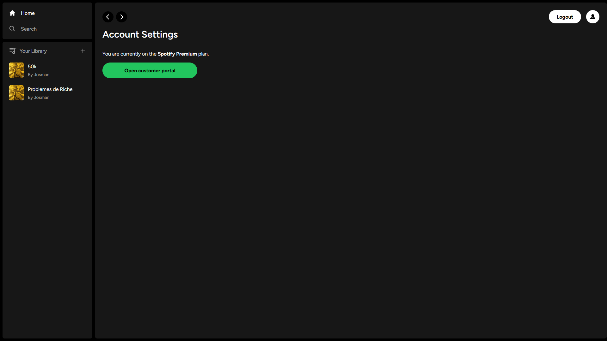

<div align="center">
<h1 align="center">

<br>SPOTIFY CLONE</h1>
<h3>◦ Your ultimate music destination: Spotify Clone!</h3>
<h3>◦ Developed with the software and tools below.</h3>

<p align="center">


</p>


</div>

---

## 📖 Table of Contents

- [📖 Table of Contents](#-table-of-contents)
- [📍 Overview](#-overview)
- [📦 Features](#-features)
- [📂 Repository Structure](#-repository-structure)
- [⚙️ Modules](#⚙️-modules)
- [🚀 Getting Started](#-getting-started)
  - [🔧 Installation](#-installation)
  - [🤖 Running SpotifyClone](#-running-spotifyclone)
- [🤝 Contributing](#-contributing)
- [📄 License](#-license)

---

## 📍 Overview

The SpotifyClone repository is a project that aims to replicate the functionality of the popular music streaming platform, Spotify. It provides a user-friendly interface where users can search for and play music, create playlists, and browse through different genres and artists. With this clone, users can enjoy a similar music streaming experience as they would on Spotify, but with the added benefit of being able to customize and modify the codebase to suit their needs.

---

## 📦 Features

|     | Feature             | Description                                                                                                                                                                                 |
| --- | ------------------- | ------------------------------------------------------------------------------------------------------------------------------------------------------------------------------------------- |
| 🎵  | **Song Upload**    | Users can upload their own songs to the application, enhancing the music library with custom content.                                                                                        |
| 💳  | **Stripe Integration**    | Integration with the Stripe API enables secure and seamless payment processing for premium features.                                                                                  |
| 🗃️  | **Supabase and PostgreSQL Database Handling**      | Utilizes Supabase and PostgreSQL for robust database management, ensuring efficient storage and retrieval of user and song data.                             |
| 🎨  | **Tailwind Design** | Implements Tailwind CSS for a sleek and visually appealing user interface, enhancing the overall user experience.                                                                           |
| 🔄  | **Tailwind Animations and Transition Effects**    | Enhances the user interface with animated elements and smooth transitions, creating an engaging and dynamic user experience.                                   |
| 📱  | **Full Responsiveness**    | Ensures the application's compatibility and optimal display on various devices, offering a seamless experience across desktops, tablets, and mobile phones.                           |
| 🔐  | **Credential Authentication with Supabase**    | Implements secure authentication using Supabase credentials, safeguarding user accounts and ensuring data privacy.                                               |
| 📤  | **File and Image Upload using Supabase Storage**    | Utilizes Supabase storage for efficient handling of file and image uploads, providing users with the capability to customize their profiles or upload album artwork.  |
| 📝  | **Client Form Validation with react-hook-form**    | Implements client-side form validation using react-hook-form, ensuring accurate and user-friendly input handling.                                            |
| 🚨  | **Server Error Handling with react-toast**    | Enhances user experience by implementing server error handling with react-toast, providing clear and informative error messages to users.                         |
| 🎶  | **Play Song Audio**    | Enables users to play audio for the selected songs directly within the application, enhancing the overall music listening experience.                                                    |
| ⭐  | **Favorites System**    | Allows users to mark and manage their favorite songs, creating a personalized music library based on individual preferences.                                                            |
| 🎼  | **Playlists / Liked Songs System**    | Implements a comprehensive system for creating playlists, as well as liking and organizing songs based on user preferences.                                               |
| 💳  | **Stripe Recurring Payment Integration**    | Enables users to subscribe to premium plans with recurring payments through the Stripe API, ensuring uninterrupted access to premium features.                      |
| 🔍  | **Fetch Data in Server React Components**    | Utilizes direct database access in server React components, optimizing data fetching for improved performance without relying on additional API calls.             |
| 🔄  | **Handling Relations in Real-Time Environment**    | Manages relationships between server and child components in real-time, ensuring synchronized updates and a seamless user experience.                        |
| 🛑  | **Cancelling Stripe Subscriptions**    | Allows users to cancel their Stripe subscriptions seamlessly within the application, providing a hassle-free process for managing premium plans.                         |

<div align="center">
  
  
</div>

<div align="center">
  
  
</div>

<div align="center">
  
  
</div>

---

## 📂 Repository Structure

```sh
└── SpotifyClone/
    ├── .eslintrc.json
    ├── .github/
    │   ├── dependabot.yml
    │   └── workflows/
    │       ├── dependabot-auto-merge.yml
    │       └── release-please.yml
    ├── actions/
    │   ├── getActiveProductsWithPrices.ts
    │   ├── getLikedSongs.ts
    │   ├── getSong.ts
    │   ├── getSongByTitle.ts
    │   └── getSongsByUserId.ts
    ├── app/
    │   ├── (site)/
    │   │   ├── components/
    │   │   ├── error.tsx
    │   │   ├── loading.tsx
    │   │   └── page.tsx
    │   ├── account/
    │   │   ├── components/
    │   │   ├── error.tsx
    │   │   ├── loading.tsx
    │   │   └── page.tsx
    │   ├── api/
    │   │   ├── create-checkout-session/
    │   │   ├── create-portal-link/
    │   │   └── webhooks/
    │   ├── error.tsx
    │   ├── globals.css
    │   ├── layout.tsx
    │   ├── liked/
    │   │   ├── components/
    │   │   └── page.tsx
    │   ├── loading.tsx
    │   └── search/
    │       ├── components/
    │       └── page.tsx
    ├── components/
    │   ├── AuthModal.tsx
    │   ├── Box.tsx
    │   ├── Button.tsx
    │   ├── Header.tsx
    │   ├── Input.tsx
    │   ├── Library.tsx
    │   ├── LikeButton.tsx
    │   ├── ListItem.tsx
    │   ├── MediaItem.tsx
    │   ├── Modal.tsx
    │   ├── PlayButton.tsx
    │   ├── Player.tsx
    │   ├── PlayerContent.tsx
    │   ├── SearchInput.tsx
    │   ├── Sidebar.tsx
    │   ├── SidebarItem.tsx
    │   ├── Slider.tsx
    │   ├── SongItem.tsx
    │   ├── SubscribeModal.tsx
    │   └── UploadModal.tsx
    ├── hooks/
    │   ├── useAuthModal.ts
    │   ├── useDebounce.ts
    │   ├── useGetSongById.ts
    │   ├── useLoadImage.ts
    │   ├── useLoadSongUrl.ts
    │   ├── useOnPlay.ts
    │   ├── usePlayer.ts
    │   ├── useSubscribeModal.ts
    │   ├── useUploadModal.ts
    │   └── useUser.tsx
    ├── libs/
    │   ├── helpers.ts
    │   ├── stripe.ts
    │   ├── stripeClient.ts
    │   └── supabaseAdmin.ts
    ├── middleware.ts
    ├── next.config.js
    ├── package-lock.json
    ├── package.json
    ├── postcss.config.js
    ├── providers/
    │   ├── ModalProvider.tsx
    │   ├── SupabaseProvider.tsx
    │   ├── ToasterProvider.tsx
    │   └── UserProvider.tsx
    ├── public/
    │   ├── images/
    ├── tailwind.config.ts
    ├── tsconfig.json
    ├── types.ts
    └── types_db.ts

```

---

## ⚙️ Modules

<details closed><summary>Root</summary>

| File                                                                                          | Summary                                                                                                                                                                                                                                                                                                                                                                                                                                                                                                                                                                                                                                                                                                                                                                                                                                                          |
| --------------------------------------------------------------------------------------------- | ---------------------------------------------------------------------------------------------------------------------------------------------------------------------------------------------------------------------------------------------------------------------------------------------------------------------------------------------------------------------------------------------------------------------------------------------------------------------------------------------------------------------------------------------------------------------------------------------------------------------------------------------------------------------------------------------------------------------------------------------------------------------------------------------------------------------------------------------------------------- |
| [next.config.js](https://github.com/TheoEwzZer/SpotifyClone/blob/main/next.config.js)         | The code in next.config.js is for configuring Next.js, a JavaScript framework for building web applications. It sets up remote patterns for handling images, specifically for a Supabase database. The remote patterns include the hostname that is dynamically generated using the SUPABASE_REFERENCE_ID environment variable from a.env file. This configuration allows Next.js to work with the Supabase database and handle images stored in it.                                                                                                                                                                                                                                                                                                                                                                                                             |
| [package-lock.json](https://github.com/TheoEwzZer/SpotifyClone/blob/main/package-lock.json)   | The code represents the directory structure of a SpotifyClone project. It includes various files and folders, such as configuration files, GitHub workflows, actions for data retrieval, components for different parts of the application, and a global stylesheet. The components folder contains reusable UI components used throughout the project, while the app folder organizes the project's functionality into different sections, like site, account, liked songs, and search. Overall, the code structure supports the implementation of a functional music streaming application resembling Spotify.                                                                                                                                                                                                                                                 |
| [.eslintrc.json](https://github.com/TheoEwzZer/SpotifyClone/blob/main/.eslintrc.json)         | The code provided is a directory tree structure that represents the file organization of a project called SpotifyClone. The core functionality of the code is managing a web application that mimics the features of the Spotify music streaming service. It includes components for the site, user account, API interactions, error handling, loading indicators, and search functionality. The project also incorporates hooks for various functionalities, libraries for Stripe payment integration and Supabase database access, and provider components for managing state and context.                                                                                                                                                                                                                                                                     |
| [tailwind.config.ts](https://github.com/TheoEwzZer/SpotifyClone/blob/main/tailwind.config.ts) | The code in the "tailwind.config.ts" file is used to configure the tailwind CSS framework. It specifies the content files that should be processed by tailwind, including pages, components, and app files. The "theme" property allows for customization and extension of the default tailwind theme. The code exports the configuration object for use in other parts of the application.                                                                                                                                                                                                                                                                                                                                                                                                                                                                      |
| [package.json](https://github.com/TheoEwzZer/SpotifyClone/blob/main/package.json)             | This code represents the directory structure and package.json file of a Spotify Clone project. It includes various directories for different functionalities such as components, hooks, APIs, and providers. The package.json file lists the project dependencies and devDependencies. It also includes scripts for development, building, starting, and linting the project. The project utilizes technologies such as Next.js, React, Tailwind CSS, Supabase, and Stripe for development.                                                                                                                                                                                                                                                                                                                                                                      |
| [middleware.ts](https://github.com/TheoEwzZer/SpotifyClone/blob/main/middleware.ts)           | The code in the `middleware.ts` file sets up a middleware function that is used in a backend server application. This function imports the `SupabaseClient` and `createMiddlewareClient` from the `@supabase/auth-helpers-nextjs` library, as well as `NextRequest` and `NextResponse` from the `next/server` module. The `middleware` function takes in a `req` (NextRequest) object and returns a `NextResponse` object. Inside the function, it creates a `SupabaseClient` instance using the `createMiddlewareClient` function and passes in the `req` and `res` (NextResponse) objects. It then calls the `getSession` method of the `supabase` client to authenticate the user's session. Finally, the function returns the `res` object.Overall, this code sets up middleware for handling authentication using Supabase in a Next.js server application. |
| [types_db.ts](https://github.com/TheoEwzZer/SpotifyClone/blob/main/types_db.ts)               | The code defines the types and relationships for a database schema called "SpotifyClone". It includes various tables such as customers, liked_songs, prices, products, songs, subscriptions, and users. Each table has defined rows, insertions, updates, and relationships with other tables. Additionally, there are enums for pricing plan intervals, pricing types, and subscription statuses. The code provides a comprehensive representation of the structure and functionality of the database.                                                                                                                                                                                                                                                                                                                                                          |
| [tsconfig.json](https://github.com/TheoEwzZer/SpotifyClone/blob/main/tsconfig.json)           | The code provides the directory tree structure for a SpotifyClone project. It includes various folders such as actions, app, components, hooks, libs, providers, and public, each serving different purposes in the project. Additionally, it includes a tsconfig.json file that specifies the compiler options and settings for the TypeScript project.                                                                                                                                                                                                                                                                                                                                                                                                                                                                                                         |
| [types.ts](https://github.com/TheoEwzZer/SpotifyClone/blob/main/types.ts)                     | The code defines several interfaces that represent the core data structures used in the SpotifyClone application. These interfaces include Song, Product, Price, Customer, UserDetails, ProductWithPrice, and Subscription. Each interface defines the properties and their types that are relevant to the corresponding data structure. These interfaces provide a blueprint for the structure and properties of the data objects used in the application.                                                                                                                                                                                                                                                                                                                                                                                                      |
| [postcss.config.js](https://github.com/TheoEwzZer/SpotifyClone/blob/main/postcss.config.js)   | The code in `postcss.config.js` sets up the configuration for PostCSS, a tool for transforming CSS with JavaScript. This specific configuration includes two plugins: `tailwindcss` and `autoprefixer`. The `tailwindcss` plugin is responsible for applying the Tailwind CSS framework to the CSS code, while the `autoprefixer` plugin adds vendor prefixes to CSS properties to ensure cross-browser compatibility.                                                                                                                                                                                                                                                                                                                                                                                                                                           |

</details>

<details closed><summary>Libs</summary>

| File                                                                                           | Summary                                                                                                                                                                                                                                                                                                                                                                                                                                                                                                                                                                                                                                                                                         |
| ---------------------------------------------------------------------------------------------- | ----------------------------------------------------------------------------------------------------------------------------------------------------------------------------------------------------------------------------------------------------------------------------------------------------------------------------------------------------------------------------------------------------------------------------------------------------------------------------------------------------------------------------------------------------------------------------------------------------------------------------------------------------------------------------------------------- |
| [helpers.ts](https://github.com/TheoEwzZer/SpotifyClone/blob/main/libs/helpers.ts)             | The code in "libs/helpers.ts" provides three functions:1. getURL(): This function returns the URL of the site by reading environment variables. It handles different cases and formats the URL appropriately.2. postData(): This function sends a POST request to the specified URL with optional data. It sets the necessary headers and handles any errors that occur during the request.3. toDateTime(): This function converts a number of seconds into a JavaScript Date object, representing a specific date and time. The initial date is set to "1970-01-01T00:30:00Z" and the function updates it based on the input seconds.                                                          |
| [supabaseAdmin.ts](https://github.com/TheoEwzZer/SpotifyClone/blob/main/libs/supabaseAdmin.ts) | This code file provides various functionalities related to the management of products, prices, and customers in a Stripe and Supabase integration. It includes functions to upsert product and price records, create or retrieve customers, and manage subscription status changes. The code also includes a helper function to copy billing details to a customer. These functionalities are used to perform various actions such as inserting/updating product and price records, creating customers, and managing subscription information.                                                                                                                                                  |
| [stripe.ts](https://github.com/TheoEwzZer/SpotifyClone/blob/main/libs/stripe.ts)               | The code in `libs/stripe.ts` imports the `Stripe` module and creates a new instance of the `Stripe` class. The instance is initialized with the environment variable `STRIPE_SECRET_KEY` as the secret key and an `apiVersion` of "2023-10-16". The `appInfo` object specifies the name of the app as "Spotify Clone" and the version number defined in `package.json`. This code allows the app to interact with the Stripe API for payment processing in the Spotify Clone application.                                                                                                                                                                                                       |
| [stripeClient.ts](https://github.com/TheoEwzZer/SpotifyClone/blob/main/libs/stripeClient.ts)   | The code in `stripeClient.ts` is responsible for handling the Stripe client for the Spotify Clone application. It imports the `loadStripe` and `Stripe` functions from the `@stripe/stripe-js` library. The `stripePromise` variable is a Promise that holds the Stripe client. The `getStripe` function is used to get the Stripe client. If the `stripePromise` is not yet initialized, it loads the Stripe client using the `loadStripe` function and sets it to `stripePromise`. The function then returns the `stripePromise`, which is resolved with the Stripe client.Overall, this code provides a way to lazily load and retrieve the Stripe client for the Spotify Clone application. |

</details>

<details closed><summary>Actions</summary>

| File                                                                                                                          | Summary                                                                                                                                                                                                                                                                                                                                                                                                                                                                                                                                                                                                                                                                                                                                                                                                                                                                                                         |
| ----------------------------------------------------------------------------------------------------------------------------- | --------------------------------------------------------------------------------------------------------------------------------------------------------------------------------------------------------------------------------------------------------------------------------------------------------------------------------------------------------------------------------------------------------------------------------------------------------------------------------------------------------------------------------------------------------------------------------------------------------------------------------------------------------------------------------------------------------------------------------------------------------------------------------------------------------------------------------------------------------------------------------------------------------------- |
| [getSong.ts](https://github.com/TheoEwzZer/SpotifyClone/blob/main/actions/getSong.ts)                                         | This code defines a function called `getSongs` that retrieves a list of songs from a database using the Supabase client. The function makes use of the `createServerComponentClient` function from the `@supabase/auth-helpers-nextjs` package to authenticate with Supabase. It then executes a query to select all the songs from the "songs" table in the database, ordering them by the creation date in descending order. If there is an error during the query, it is logged to the console and an empty array is returned. Finally, the function returns the retrieved songs as an array.                                                                                                                                                                                                                                                                                                                |
| [getSongByTitle.ts](https://github.com/TheoEwzZer/SpotifyClone/blob/main/actions/getSongByTitle.ts)                           | The code in `actions/getSongByTitle.ts` exports a function called `getSongsByTitle` that retrieves songs from a Supabase database based on a given title. It uses the `SupabaseClient` and `createServerComponentClient` from the `@supabase/auth-helpers-nextjs` package to authenticate and interact with the Supabase API. If a title is provided, it performs a case-insensitive search for songs with a matching title and returns them in descending order of creation. If no title is provided, it retrieves all songs. If an error occurs during the retrieval process, an empty array is returned.                                                                                                                                                                                                                                                                                                     |
| [getSongsByUserId.ts](https://github.com/TheoEwzZer/SpotifyClone/blob/main/actions/getSongsByUserId.ts)                       | The code is a function called `getSongsByUserId` that retrieves a list of songs by user ID from a Supabase database. It uses the `@supabase/auth-helpers-nextjs` library to create a server component client and authenticate with Supabase. The function first checks if there is an active session, and if there is not, it logs an error message and returns an empty array. If there is an active session, it queries the "songs" table in the database and retrieves all songs associated with the user ID. The songs are then returned as an array.                                                                                                                                                                                                                                                                                                                                                       |
| [getLikedSongs.ts](https://github.com/TheoEwzZer/SpotifyClone/blob/main/actions/getLikedSongs.ts)                             | The code in `actions/getLikedSongs.ts` is a function that retrieves liked songs from the database. It imports the `Song` type and the `SupabaseClient` from the `@/types` and `@supabase/auth-helpers-nextjs` modules, respectively. It also imports the `cookies` object from the `next/headers` module.The function, `getLikedSongs`, returns a promise that resolves to an array of `Song` objects. It creates a `SupabaseClient` instance using the `createServerComponentClient` function and the `cookies` provided. It then uses the `supabase` instance to perform a query on the `liked_songs` table, retrieving all records with a specified `user_id` and ordering them by `created_at` in descending order.If no data is returned from the query, an empty array is returned. Otherwise, the function maps the data to extract the `songs` property from each item and returns the resulting array. |
| [getActiveProductsWithPrices.ts](https://github.com/TheoEwzZer/SpotifyClone/blob/main/actions/getActiveProductsWithPrices.ts) | The code in `actions/getActiveProductsWithPrices.ts` defines a function that retrieves a list of active products with their corresponding prices from a Supabase database. It uses the `SupabaseClient` and `createServerComponentClient` modules from `@supabase/auth-helpers-nextjs` to establish a connection with the database. The function then performs a query to select the active products along with their prices, orders the results based on certain criteria, and returns the data as an array of `ProductWithPrice` objects.                                                                                                                                                                                                                                                                                                                                                                     |

</details>

<details closed><summary>Hooks</summary>

| File                                                                                                    | Summary                                                                                                                                                                                                                                                                                                                                                                                                                                                                                                                                                                                                                                                                              |
| ------------------------------------------------------------------------------------------------------- | ------------------------------------------------------------------------------------------------------------------------------------------------------------------------------------------------------------------------------------------------------------------------------------------------------------------------------------------------------------------------------------------------------------------------------------------------------------------------------------------------------------------------------------------------------------------------------------------------------------------------------------------------------------------------------------ |
| [useDebounce.ts](https://github.com/TheoEwzZer/SpotifyClone/blob/main/hooks/useDebounce.ts)             | The `useDebounce` hook is a custom React hook that allows you to debounce a value. It takes in a value and an optional delay as parameters and returns a debounced value. The debounced value is updated after the specified delay has passed since the last update of the input value. This can be useful in scenarios where you want to reduce the frequency of updates, such as in search input fields where you may want to wait for the user to finish typing before triggering a search.                                                                                                                                                                                       |
| [useAuthModal.ts](https://github.com/TheoEwzZer/SpotifyClone/blob/main/hooks/useAuthModal.ts)           | The code is an implementation of a custom hook called `useAuthModal`. This hook is used to manage the state of an authentication modal, providing functionalities to control its visibility. The hook creates a Zustand store, which is a state management solution, and returns the store API with three properties: `isOpen` (a boolean indicating whether the modal is open), `onOpen` (a function to open the modal), and `onClose` (a function to close the modal). The hook allows other components to easily manage the authentication modal state.                                                                                                                           |
| [useSubscribeModal.ts](https://github.com/TheoEwzZer/SpotifyClone/blob/main/hooks/useSubscribeModal.ts) | The code is a TypeScript module that defines a custom hook called "useSubscribeModal". This hook uses the Zustand library to manage state. It creates a store with an initial state object containing a boolean property "isOpen" and two methods "onOpen" and "onClose". The "onOpen" method sets the "isOpen" property to true, while the "onClose" method sets it to false. The hook returns the store, allowing the calling component to access and update the "isOpen" state as needed.                                                                                                                                                                                         |
| [useUser.tsx](https://github.com/TheoEwzZer/SpotifyClone/blob/main/hooks/useUser.tsx)                   | The code above defines the `useUser` hook and the `MyUserContextProvider` component, which manage user authentication and user information in a React app. The `useUser` hook retrieves the user context from the `UserContext` Context, while the `MyUserContextProvider` component sets up the user context and fetches the user details and subscription information from the Supabase database.                                                                                                                                                                                                                                                                                  |
| [useUploadModal.ts](https://github.com/TheoEwzZer/SpotifyClone/blob/main/hooks/useUploadModal.ts)       | The code defines a custom hook called `useUploadModal` that provides state management functionality for an upload modal. It uses the Zustand library to create a store with an `isOpen` boolean value and two functions, `onOpen` and `onClose`, to control the visibility of the modal. The hook returns the store instance and can be used to manage the upload modal state in a React component.                                                                                                                                                                                                                                                                                  |
| [usePlayer.ts](https://github.com/TheoEwzZer/SpotifyClone/blob/main/hooks/usePlayer.ts)                 | The code defines a custom hook called "usePlayer" that utilizes the Zustand library for state management. It provides a store with the following functionalities:-maintaining an array of song IDs-setting the active song ID-setting the song IDs-resetting the state (clearing the song IDs and active ID).                                                                                                                                                                                                                                                                                                                                                                        |
| [useLoadImage.ts](https://github.com/TheoEwzZer/SpotifyClone/blob/main/hooks/useLoadImage.ts)           | The code in `hooks/useLoadImage.ts` defines a custom hook named `useLoadImage`. This hook takes a `Song` object as an argument and returns a string representing the public URL of the image associated with the song. The hook uses the `useSupabaseClient` hook from the `@supabase/auth-helpers-react` package to access the Supabase client instance. If the `song` argument is not provided, the hook returns `null`. Otherwise, it calls the `getPublicUrl` method of the Supabase client's storage module to retrieve the public URL of the image and returns it.                                                                                                             |
| [useOnPlay.ts](https://github.com/TheoEwzZer/SpotifyClone/blob/main/hooks/useOnPlay.ts)                 | The code in `useOnPlay.ts` is a custom React hook that handles the logic for playing a song. It takes an array of songs as an argument and returns a function `onPlay` that is called when a song is played. Inside `onPlay`, it first checks if there is a logged-in user. If not, it opens an authentication modal to prompt the user to log in. If there is a logged-in user, it then checks if the user has a subscription. If not, it opens a modal to prompt the user to subscribe. Finally, it sets the current song ID in the player store and sets the array of song IDs in the player store based on the provided array of songs.The hook is then exported as `useOnPlay`. |
| [useLoadSongUrl.ts](https://github.com/TheoEwzZer/SpotifyClone/blob/main/hooks/useLoadSongUrl.ts)       | The code in `hooks/useLoadSongUrl.ts` defines a custom hook called `useLoadSongUrl`. This hook takes a `song` object as a parameter and retrieves the public URL of the song file using the Supabase client. If the `song` object is not provided, it returns an empty string. The hook returns the public URL of the song file.                                                                                                                                                                                                                                                                                                                                                     |
| [useGetSongById.ts](https://github.com/TheoEwzZer/SpotifyClone/blob/main/hooks/useGetSongById.ts)       | The code defines a custom hook called "useGetSongById" that fetches a song by its ID. It uses the React and react-hot-toast libraries. The hook manages the loading state and song data, and relies on the supabaseClient from the useSessionContext hook for communication with a Supabase database. It returns the isLoading state and the fetched song as objects in a useMemo hook for optimization purposes.                                                                                                                                                                                                                                                                    |

</details>

<details closed><summary>.github</summary>

| File                                                                                          | Summary                                                                                                                                                                                                                                                                                                                                                                                                           |
| --------------------------------------------------------------------------------------------- | ----------------------------------------------------------------------------------------------------------------------------------------------------------------------------------------------------------------------------------------------------------------------------------------------------------------------------------------------------------------------------------------------------------------- |
| [dependabot.yml](https://github.com/TheoEwzZer/SpotifyClone/blob/main/.github/dependabot.yml) | The code in the.github/dependabot.yml file sets up automated dependency updates using Dependabot. It specifies that the package ecosystem to update is npm and the package manifests are located in the root directory ("/"). The configuration also includes an ignore rule for the "typescript" dependency. The updates are scheduled to run daily and each update commit message will have a prefix of "deps". |

</details>

<details closed><summary>Workflows</summary>

| File                                                                                                                          | Summary                                                                                                                                                                                                                                                                                                                                                                                                                                                                                                                                                                                                                                                                                                                                                                                                                                                                                                                                                                                                                                                                                                                                                   |
| ----------------------------------------------------------------------------------------------------------------------------- | --------------------------------------------------------------------------------------------------------------------------------------------------------------------------------------------------------------------------------------------------------------------------------------------------------------------------------------------------------------------------------------------------------------------------------------------------------------------------------------------------------------------------------------------------------------------------------------------------------------------------------------------------------------------------------------------------------------------------------------------------------------------------------------------------------------------------------------------------------------------------------------------------------------------------------------------------------------------------------------------------------------------------------------------------------------------------------------------------------------------------------------------------------- |
| [dependabot-auto-merge.yml](https://github.com/TheoEwzZer/SpotifyClone/blob/main/.github/workflows/dependabot-auto-merge.yml) | This code is a GitHub Actions workflow that enables auto-merge for Dependabot pull requests. It runs on an Ubuntu environment and is triggered when a pull request event is generated by the Dependabot bot. The workflow fetches the metadata of the Dependabot pull request using the `dependabot/fetch-metadata` action and then utilizes the GitHub CLI (`gh`) to automatically merge the pull request. The auto-merge is performed by running the `gh pr merge` command with the necessary environment variables, including the pull request URL and the GitHub token.                                                                                                                                                                                                                                                                                                                                                                                                                                                                                                                                                                               |
| [release-please.yml](https://github.com/TheoEwzZer/SpotifyClone/blob/main/.github/workflows/release-please.yml)               | The code is a GitHub workflow file (release-please.yml) that specifies a set of actions to be performed when a new code push occurs on the `main` branch. The workflow is triggered by a push event and has permissions to write contents and pull requests.The workflow consists of a single job named "release-please" that runs on an Ubuntu environment. It contains several steps:1. Uses the `google-github-actions/release-please-action` action to automatically generate release tags and changelogs based on commit messages.2. Checks out the code from the repository using the `actions/checkout` action.3. Tags and pushes major and minor versions of the code to the remote repository.-Sets the git user name and email to "github-actions[bot]".-Adds the GitHub token as a remote for authentication.-Deletes existing tags if they exist.-Creates new tags for the major and minor release versions.-Pushes the tags to the remote repository.This workflow is designed to automate the release process by generating release tags and changelogs based on the commit messages and tagging the code with appropriate version numbers. |

</details>

<details closed><summary>App</summary>

| File                                                                                | Summary                                                                                                                                                                                                                                                                                                                                                                                                                                  |
| ----------------------------------------------------------------------------------- | ---------------------------------------------------------------------------------------------------------------------------------------------------------------------------------------------------------------------------------------------------------------------------------------------------------------------------------------------------------------------------------------------------------------------------------------- |
| [layout.tsx](https://github.com/TheoEwzZer/SpotifyClone/blob/main/app/layout.tsx)   | The code defines the layout for the Spotify Clone application. It imports various components and providers to create the structure of the app. It also makes use of actions to fetch data and types to define the data structures. The layout includes a sidebar, a player, and providers for functionalities like modals and user authentication. The layout component renders the children components within the app's HTML structure. |
| [loading.tsx](https://github.com/TheoEwzZer/SpotifyClone/blob/main/app/loading.tsx) | The code in `app/loading.tsx` exports a React component called `Loading`. This component displays a loading animation using the `BounceLoader` component from the `react-spinners` package. The loading animation is shown inside a `Box` component, which is centered on the screen using flexbox. The `BounceLoader` component is configured with a green color and a size of 40.                                                      |
| [error.tsx](https://github.com/TheoEwzZer/SpotifyClone/blob/main/app/error.tsx)     | The code in `app/error.tsx` is a React component that renders an error message when something goes wrong. It imports the `Box` component from "@/components/Box" library and returns a JSX element that displays the error message inside a box.                                                                                                                                                                                         |
| [globals.css](https://github.com/TheoEwzZer/SpotifyClone/blob/main/app/globals.css) | The code in the file "app/globals.css" sets the global styles for the application. It imports Tailwind CSS and applies base, component, and utility styles. It sets the height of the html, body, and root elements to 100% and sets the background color to black. It also sets the color scheme to dark.                                                                                                                               |

</details>

<details closed><summary>Liked</summary>

| File                                                                                | Summary                                                                                                                                                                                                                                                                                                                                                                                                                                   |
| ----------------------------------------------------------------------------------- | ----------------------------------------------------------------------------------------------------------------------------------------------------------------------------------------------------------------------------------------------------------------------------------------------------------------------------------------------------------------------------------------------------------------------------------------- |
| [page.tsx](https://github.com/TheoEwzZer/SpotifyClone/blob/main/app/liked/page.tsx) | The code above represents the Liked page of a Spotify clone application. It imports the necessary components and functions to display a list of liked songs. It fetches the liked songs using the "getLikedSongs" function and renders them on the page. The page also includes a header with the title "Liked Songs" and an image representing a playlist. The LikedContent component is responsible for rendering the individual songs. |

</details>

<details closed><summary>Components</summary>

| File                                                                                                                 | Summary                                                                                                                                                                                                                                                                                                                                                                                                                                                                                                                                                                                                                                                                                                                                                                                                                                                                                                                                                                                                                            |
| -------------------------------------------------------------------------------------------------------------------- | ---------------------------------------------------------------------------------------------------------------------------------------------------------------------------------------------------------------------------------------------------------------------------------------------------------------------------------------------------------------------------------------------------------------------------------------------------------------------------------------------------------------------------------------------------------------------------------------------------------------------------------------------------------------------------------------------------------------------------------------------------------------------------------------------------------------------------------------------------------------------------------------------------------------------------------------------------------------------------------------------------------------------------------- |
| [LikedContent.tsx](https://github.com/TheoEwzZer/SpotifyClone/blob/main/app/liked/components/LikedContent.tsx)       | The code provided is a React component called "LikedContent" that renders a list of liked songs. It imports necessary dependencies and hooks like "useEffect" and "useRouter" from the React and Next.js libraries. It also imports custom hooks like "useUser" and "useOnPlay". The component checks if the user is authenticated and redirects them to the homepage if they are not. It then renders the list of liked songs along with some UI components like "MediaItem" and "LikeButton".                                                                                                                                                                                                                                                                                                                                                                                                                                                                                                                                    |
| [PageContent.tsx](<https://github.com/TheoEwzZer/SpotifyClone/blob/main/app/(site)/components/PageContent.tsx>)      | The code is a React component that renders a grid of songs. It takes an array of songs as input and uses the `useOnPlay` hook to handle the play functionality. If there are no songs available, it displays a message; otherwise, it renders each song as a `SongItem` component within the grid. The `SongItem` component receives the song data and an `onClick` function to handle the play action.                                                                                                                                                                                                                                                                                                                                                                                                                                                                                                                                                                                                                            |
| [AccountContent.tsx](https://github.com/TheoEwzZer/SpotifyClone/blob/main/app/account/components/AccountContent.tsx) | The code is a React component called AccountContent. It imports various dependencies such as useRouter, useEffect, useState, toast, and custom hooks like useSubscribeModal and useUser. The component displays different content based on the user's subscription status. If no subscription exists, it displays a message and a button to subscribe. If a subscription exists, it displays the subscribed plan's name and a button to open the customer portal. The component also handles redirection and error handling.                                                                                                                                                                                                                                                                                                                                                                                                                                                                                                       |
| [SearchContent.tsx](https://github.com/TheoEwzZer/SpotifyClone/blob/main/app/search/components/SearchContent.tsx)    | The code defines a React component called SearchContent, which renders a list of songs. It receives an array of Song objects as a prop and maps through the array to render a MediaItem component for each song. The MediaItem component displays the song's details and provides an onClick function to play the song. The SearchContent component also renders a LikeButton component for each song, allowing users to like the songs. If no songs are found, a message indicating that no songs were found is displayed.                                                                                                                                                                                                                                                                                                                                                                                                                                                                                                        |
| [SongItem.tsx](https://github.com/TheoEwzZer/SpotifyClone/blob/main/components/SongItem.tsx)                         | The code is a React component called SongItem. It is responsible for rendering a song item with its title, author, and image. It uses the useLoadImage hook to load the image of the song. The SongItem component also takes a data prop, which represents the song data, and an onClick prop, which represents the click event handler for the song item. When the song item is clicked, the onClick function is called with the song's id as an argument. The SongItem component also includes a PlayButton component that is displayed in the bottom-right corner of the song item.                                                                                                                                                                                                                                                                                                                                                                                                                                             |
| [Header.tsx](https://github.com/TheoEwzZer/SpotifyClone/blob/main/components/Header.tsx)                             | The code is a React component called "Header" that renders a navigation header for a website. It imports various dependencies and custom hooks for authentication, routing, and player functionality. The component displays navigation buttons and icons for going back and forward, home, and search. It also includes buttons for log in, sign up, and user account pages. The header dynamically adjusts its content based on whether a user is logged in or not.                                                                                                                                                                                                                                                                                                                                                                                                                                                                                                                                                              |
| [Library.tsx](https://github.com/TheoEwzZer/SpotifyClone/blob/main/components/Library.tsx)                           | The code represents a React component called Library, which is responsible for rendering a user's library of songs. The component uses various hooks and stores to handle user authentication, uploading songs, and subscribing to a service. It displays a header with the title "Your Library" and an icon, and allows the user to add new songs to their library by clicking on a plus icon. The component also renders a list of songs, each with a clickable MediaItem component that triggers the onPlay function when clicked.                                                                                                                                                                                                                                                                                                                                                                                                                                                                                              |
| [Input.tsx](https://github.com/TheoEwzZer/SpotifyClone/blob/main/components/Input.tsx)                               | The code defines an Input component that is used for creating input fields in a web application. It imports necessary dependencies from React and Tailwind CSS. The component takes various props for customizing the input field, such as className, type, and disabled. It uses the forwardRef function from React to forward refs to the underlying input element. The component renders an input element with specified styles based on the props and also handles the disabled state. Finally, the component is exported as the default export.                                                                                                                                                                                                                                                                                                                                                                                                                                                                               |
| [LikeButton.tsx](https://github.com/TheoEwzZer/SpotifyClone/blob/main/components/LikeButton.tsx)                     | The LikeButton component is responsible for rendering a button that allows the user to like or unlike a song. It imports various dependencies such as react-icons, react-hot-toast, and react-router. The button toggles its appearance based on whether the song has been liked or not. It also handles user authentication and updates the database accordingly when the button is clicked.                                                                                                                                                                                                                                                                                                                                                                                                                                                                                                                                                                                                                                      |
| [Button.tsx](https://github.com/TheoEwzZer/SpotifyClone/blob/main/components/Button.tsx)                             | The code above defines the Button component, which is a forwardRef component that renders a `<button>` element. It accepts standard button attributes and additional ButtonProps. The component applies Tailwind CSS classes to style the button, including rounded corners, background color, and hover effects. It also handles the disabled state and forwards the ref to the underlying `<button>` element. Finally, it exports the Button component as the default export.                                                                                                                                                                                                                                                                                                                                                                                                                                                                                                                                                    |
| [Modal.tsx](https://github.com/TheoEwzZer/SpotifyClone/blob/main/components/Modal.tsx)                               | The code represents a React component called "Modal" that renders a modal dialog box. It accepts several props including "isOpen" to control the visibility of the modal, "onChange" to handle the open/close state, "title" and "description" to display the content, and "children" to provide custom content within the modal. The modal includes a close button with an "IoMdClose" icon. The styling is done using Tailwind CSS, and the component is exported as the default.                                                                                                                                                                                                                                                                                                                                                                                                                                                                                                                                                |
| [Box.tsx](https://github.com/TheoEwzZer/SpotifyClone/blob/main/components/Box.tsx)                                   | The code in the `Box.tsx` file defines a React component called `Box`. It takes two props: `children` and `className`. The component renders a div element with a class name that merges the provided `className` prop with the default classes "bg-neutral-900 rounded-md h-fill w-full". The `children` prop is rendered as the content of the div. The component is exported as the default export of the file.                                                                                                                                                                                                                                                                                                                                                                                                                                                                                                                                                                                                                 |
| [AuthModal.tsx](https://github.com/TheoEwzZer/SpotifyClone/blob/main/components/AuthModal.tsx)                       | The code is a React component (`AuthModal.tsx`) that renders a modal for user authentication. It imports and uses various packages and libraries, including `@supabase/auth-helpers-react`, `next/navigation`, `Modal` (a custom component), `Auth` (from `@supabase/auth-ui-react`), and `useAuthModal` (a custom hook). The modal is used to login to a user's account using Supabase authentication, and it includes custom styling and appearance options. The component also handles the logic for closing the modal when the user is logged in.                                                                                                                                                                                                                                                                                                                                                                                                                                                                              |
| [SubscribeModal.tsx](https://github.com/TheoEwzZer/SpotifyClone/blob/main/components/SubscribeModal.tsx)             | The code defines a SubscribeModal component that displays subscription options for a Spotify-like application. When rendered, it retrieves the user's data and displays a list of available products (with their respective prices). The user can then click on a button to subscribe to a specific product. The component handles the logic for creating a checkout session and redirects the user to the Stripe payment flow. It also handles error cases and displays appropriate messages using the toast library.                                                                                                                                                                                                                                                                                                                                                                                                                                                                                                             |
| [Slider.tsx](https://github.com/TheoEwzZer/SpotifyClone/blob/main/components/Slider.tsx)                             | The code represents a Slider component used in a React application. It imports and utilizes the "@radix-ui/react-slider" library for the slider functionality. The Slider component accepts two props: "value" and "onChange". The value prop represents the current value of the slider, and the onChange prop is a callback function triggered when the value of the slider changes. The component renders a slider UI element with the specified value, range, and other attributes.                                                                                                                                                                                                                                                                                                                                                                                                                                                                                                                                            |
| [SearchInput.tsx](https://github.com/TheoEwzZer/SpotifyClone/blob/main/components/SearchInput.tsx)                   | The code is a React component called SearchInput that renders an input field for users to enter search queries. It uses the useState hook to manage the value of the input field. The useDebounce hook is used to delay the search action and prevent unnecessary API calls while the user is typing. The useEffect hook is used to update the URL and trigger a search when the debounced value changes. The component also imports and renders the Input component, which is a custom input field component.                                                                                                                                                                                                                                                                                                                                                                                                                                                                                                                     |
| [ListItem.tsx](https://github.com/TheoEwzZer/SpotifyClone/blob/main/components/ListItem.tsx)                         | The code is a TypeScript file located at `components/ListItem.tsx` in a project called "SpotifyClone". It defines a React functional component called "ListItem" that represents an item in a list. The component takes in three props: `image`, `name`, and `href`. It uses the `next/image` package to display an image, and renders the `name` as a truncated text. When the user clicks on the item, it checks if there is a logged-in user. If there is no user, it opens an authentication modal. If there is a user, it navigates to the specified `href` using the `next/router` package. The component also includes a play button (`FaPlay`) that is initially hidden but appears when the user hovers over the item.                                                                                                                                                                                                                                                                                                    |
| [PlayButton.tsx](https://github.com/TheoEwzZer/SpotifyClone/blob/main/components/PlayButton.tsx)                     | The code is for a PlayButton component that displays a button with a play icon. The button has various styling, including a transition effect, rounded shape, green background color, and drop shadow. It also has hover and group hover effects that change the opacity, translation, and scale of the button. The FaPlay icon from the react-icons/fa library is used inside the button. The component is exported as the default.                                                                                                                                                                                                                                                                                                                                                                                                                                                                                                                                                                                               |
| [UploadModal.tsx](https://github.com/TheoEwzZer/SpotifyClone/blob/main/components/UploadModal.tsx)                   | The UploadModal component is responsible for rendering a modal that allows the user to upload a new song to the application. It utilizes various dependencies and hooks such as SupabaseClient, useSupabaseClient, useUser, and useForm for managing form state. The component handles the submission of the form, including the uploading of the song file and image file to Supabase storage, and the creation of a new record in the songs table using SupabaseClient. It also handles error cases and displays toast notifications.                                                                                                                                                                                                                                                                                                                                                                                                                                                                                            |
| [MediaItem.tsx](https://github.com/TheoEwzZer/SpotifyClone/blob/main/components/MediaItem.tsx)                       | The code for the "MediaItem" component defines a visual representation of a media item (song) in a music player interface. It imports necessary dependencies, creates a React functional component, defines the component's props interface, and establishes some local state using custom hooks. The component renders an image, song title, and author, and handles click events to trigger playback or execute a custom click handler if provided.                                                                                                                                                                                                                                                                                                                                                                                                                                                                                                                                                                              |
| [Player.tsx](https://github.com/TheoEwzZer/SpotifyClone/blob/main/components/Player.tsx)                             | The code represents the Player component in a Spotify clone application. It imports various custom hooks and the PlayerContent component. The Player component fetches the active song from the useGetSongById hook and loads the song URL using the useLoadSongUrl hook. It then renders the PlayerContent component with the fetched song and URL, wrapped in a fixed position container at the bottom of the screen.                                                                                                                                                                                                                                                                                                                                                                                                                                                                                                                                                                                                            |
| [SidebarItem.tsx](https://github.com/TheoEwzZer/SpotifyClone/blob/main/components/SidebarItem.tsx)                   | The code provided is a TypeScript module that exports a React component called "SidebarItem". This component is responsible for rendering a sidebar item with an icon, label, and a link. It takes the following props:-"icon" (of type IconType): an icon component to be displayed-"label" (of type string): the label or name of the sidebar item-"active" (optional boolean): indicates if the item is active/highlighted-"href" (of type string): the URL to navigate to when the item is clickedThe component uses the "next/link" module to handle the navigation to the provided "href" value. It also utilizes Tailwind CSS utility classes to style the sidebar item based on its active state.                                                                                                                                                                                                                                                                                                                          |
| [PlayerContent.tsx](https://github.com/TheoEwzZer/SpotifyClone/blob/main/components/PlayerContent.tsx)               | The code is a React component called PlayerContent, which is responsible for rendering the player interface for a song in a music player application. It imports necessary dependencies, such as a custom hook called usePlayer and external libraries like react-icons and use-sound. The component accepts props for the song object and its URL. It provides functionalities for playing/pausing the song, changing the volume, and skipping to the next/previous song. It also displays the media item and like button for the current song.                                                                                                                                                                                                                                                                                                                                                                                                                                                                                   |
| [Sidebar.tsx](https://github.com/TheoEwzZer/SpotifyClone/blob/main/components/Sidebar.tsx)                           | The code is a React component called "Sidebar" that represents the sidebar of a music player application. It imports various icons and components, such as "SidebarItem", "Box", and "Library". The component receives two props: "children" (representing the content displayed in the main section of the sidebar) and "songs" (an array of song objects). The component uses the "usePathname" hook from the "next/navigation" package to determine the current URL pathname. It also uses the "usePlayer" hook to access the player state.The component renders a sidebar with two items: "Home" and "Search". The active item is determined based on the current pathname. It also renders a "Library" component that displays the list of songs passed as a prop.The size of the sidebar is adjusted based on the state of the player. If there is an active song playing, the sidebar's height is reduced.Overall, the Sidebar component provides a navigation menu and a library section for the music player application. |

</details>

<details closed><summary>(site)</summary>

| File                                                                                         | Summary                                                                                                                                                                                                                                                                                                                                                                                       |
| -------------------------------------------------------------------------------------------- | --------------------------------------------------------------------------------------------------------------------------------------------------------------------------------------------------------------------------------------------------------------------------------------------------------------------------------------------------------------------------------------------- |
| [page.tsx](<https://github.com/TheoEwzZer/SpotifyClone/blob/main/app/(site)/page.tsx>)       | The code represents the home page of a Spotify clone app. It imports the getSongs function from the "getSong" action, as well as the Header and ListItem components. The Home function fetches a list of songs using getSongs and renders the home page with a header, a list of liked songs, and the newest songs. The PageContent component is responsible for rendering the list of songs. |
| [loading.tsx](<https://github.com/TheoEwzZer/SpotifyClone/blob/main/app/(site)/loading.tsx>) | The code provided in "app/(site)/loading.tsx" is a React component that displays a loading spinner. It imports the "BounceLoader" component from the "react-spinners" library and the "Box" component from "@/components/Box". The loading spinner is rendered inside the "Box" component. The spinner is styled with a green color and a size of 40.                                         |
| [error.tsx](<https://github.com/TheoEwzZer/SpotifyClone/blob/main/app/(site)/error.tsx>)     | The code in app/(site)/error.tsx is a React component that renders an error message. It imports the Box component from "@/components/Box" and uses it to display a container with centered content. The content is a text message that says "Something went wrong.                                                                                                                            |

</details>

<details closed><summary>Create-checkout-session</summary>

| File                                                                                                      | Summary                                                                                                                                                                                                                                                                                                                                                                                                                                                                                                                                                                                      |
| --------------------------------------------------------------------------------------------------------- | -------------------------------------------------------------------------------------------------------------------------------------------------------------------------------------------------------------------------------------------------------------------------------------------------------------------------------------------------------------------------------------------------------------------------------------------------------------------------------------------------------------------------------------------------------------------------------------------- |
| [route.ts](https://github.com/TheoEwzZer/SpotifyClone/blob/main/app/api/create-checkout-session/route.ts) | The code is responsible for handling the creation of a checkout session for a subscription payment. It imports various libraries and helper functions to facilitate this process. The `POST` function takes a request and extracts the necessary information such as the price, quantity, and metadata from the request body. It then uses the Supabase and Stripe libraries to authenticate the user, create or retrieve the customer, and create a checkout session with the provided details. Finally, it returns the session ID as a response or an error message in case of any issues. |

</details>

<details closed><summary>Webhooks</summary>

| File                                                                                       | Summary                                                                                                                                                                                                                                                                                                                                                                                                                                                                                                                                                                                                                          |
| ------------------------------------------------------------------------------------------ | -------------------------------------------------------------------------------------------------------------------------------------------------------------------------------------------------------------------------------------------------------------------------------------------------------------------------------------------------------------------------------------------------------------------------------------------------------------------------------------------------------------------------------------------------------------------------------------------------------------------------------- |
| [route.ts](https://github.com/TheoEwzZer/SpotifyClone/blob/main/app/api/webhooks/route.ts) | The code is an implementation of a webhook route for handling events from the Stripe API. It checks for specific relevant events such as product or price updates, checkout session completion, and customer subscription changes. It uses the Stripe library to verify the webhook signature and process the event data. If the event is relevant, it performs appropriate actions based on the event type, such as updating product or price records, managing subscription status changes, or processing completed checkout sessions. Finally, it returns a JSON response indicating successful receipt of the webhook event. |

</details>

<details closed><summary>Create-portal-link</summary>

| File                                                                                                 | Summary                                                                                                                                                                                                                                                                                                                                                                                                                                                                                                                                                                                                                                                                                                                                                                                         |
| ---------------------------------------------------------------------------------------------------- | ----------------------------------------------------------------------------------------------------------------------------------------------------------------------------------------------------------------------------------------------------------------------------------------------------------------------------------------------------------------------------------------------------------------------------------------------------------------------------------------------------------------------------------------------------------------------------------------------------------------------------------------------------------------------------------------------------------------------------------------------------------------------------------------------- |
| [route.ts](https://github.com/TheoEwzZer/SpotifyClone/blob/main/app/api/create-portal-link/route.ts) | This code defines a route handler for creating a billing portal link. It imports various dependencies such as SupabaseClient, headers from the next module, and NextResponse from the next/server module. It also imports helper functions from the "libs" directory to handle stripe and supabase operations. The POST function makes use of the SupabaseClient and next/headers to authenticate the user and retrieve their information. It then creates or retrieves a customer using the supabaseAdmin library. The customer ID is used to create a billing portal session using the stripe library. Finally, the function returns the URL for the billing portal session.In case of an error, the function logs the error and returns a NextResponse with an internal server error status. |

</details>

<details closed><summary>Account</summary>

| File                                                                                        | Summary                                                                                                                                                                                                                                                                                                                                                                                         |
| ------------------------------------------------------------------------------------------- | ----------------------------------------------------------------------------------------------------------------------------------------------------------------------------------------------------------------------------------------------------------------------------------------------------------------------------------------------------------------------------------------------- |
| [page.tsx](https://github.com/TheoEwzZer/SpotifyClone/blob/main/app/account/page.tsx)       | The code represents the page component for the Account Settings feature in a Spotify clone. It imports the Header component and an AccountContent component. It renders a container div with a background color and rounded corners. Inside the container, it includes a Header component with a title and AccountContent component below it. The component is exported as the default export.  |
| [loading.tsx](https://github.com/TheoEwzZer/SpotifyClone/blob/main/app/account/loading.tsx) | The code in `app/account/loading.tsx` exports a React component called `Loading`. This component renders a spinning loader animation using the `BounceLoader` component from the `react-spinners` library. The loader is displayed in a `Box` component, which is centered within the page using flexbox. The loader is styled with a green color (`#22c55e`) and a size of 40 pixels.          |
| [error.tsx](https://github.com/TheoEwzZer/SpotifyClone/blob/main/app/account/error.tsx)     | The code in `app/account/error.tsx` defines a React component called `Error`. This component renders a `<Box>` component from the `@/components/Box` module. It displays a message "Something went wrong." inside the box and centers it vertically and horizontally on the page. The code uses the `useClient` hook, most likely from a client library, to handle communication with a server. |

</details>

<details closed><summary>Search</summary>

| File                                                                                 | Summary                                                                                                                                                                                                                                                                                                                                                                                                                                                                                                                                                                  |
| ------------------------------------------------------------------------------------ | ------------------------------------------------------------------------------------------------------------------------------------------------------------------------------------------------------------------------------------------------------------------------------------------------------------------------------------------------------------------------------------------------------------------------------------------------------------------------------------------------------------------------------------------------------------------------ |
| [page.tsx](https://github.com/TheoEwzZer/SpotifyClone/blob/main/app/search/page.tsx) | The code above is a React component for the search page of a music application. It imports the `getSongsByTitle` function, the `Header` component, the `SearchInput` component, and the `Song` interface from different files. The component displays a header with a title and a search input. It then calls the `getSongsByTitle` function to fetch a list of songs based on the search parameters. The fetched songs are passed as props to the `SearchContent` component, which renders the search results. The component is then exported as the default component. |

</details>

<details closed><summary>Providers</summary>

| File                                                                                                        | Summary                                                                                                                                                                                                                                                                                                                                                                                                                                                                                                                                                                                                                                                          |
| ----------------------------------------------------------------------------------------------------------- | ---------------------------------------------------------------------------------------------------------------------------------------------------------------------------------------------------------------------------------------------------------------------------------------------------------------------------------------------------------------------------------------------------------------------------------------------------------------------------------------------------------------------------------------------------------------------------------------------------------------------------------------------------------------- |
| [UserProvider.tsx](https://github.com/TheoEwzZer/SpotifyClone/blob/main/providers/UserProvider.tsx)         | The code in the UserProvider.tsx file is responsible for exporting the UserProvider component, which is used to provide a context for managing user data. It imports the MyUserContextProvider component from the useUser hook and wraps it around the children components, ensuring that the user context is available to them.                                                                                                                                                                                                                                                                                                                                 |
| [ToasterProvider.tsx](https://github.com/TheoEwzZer/SpotifyClone/blob/main/providers/ToasterProvider.tsx)   | The code in `providers/ToasterProvider.tsx` is responsible for exporting a React component called `ToasterProvider`. This component renders a `Toaster` component from the `react-hot-toast` library. The `Toaster` component is used to display toast notifications in the application. It customizes the appearance of the toastr notifications by setting the background color to `#333333` and the text color to `#FFFFFF`. The `ToasterProvider` component is meant to be used as a higher-order component, wrapping other components that need to display toast notifications.                                                                             |
| [SupabaseProvider.tsx](https://github.com/TheoEwzZer/SpotifyClone/blob/main/providers/SupabaseProvider.tsx) | The code in the file `SupabaseProvider.tsx` exports a React component called `SupabaseProvider`. It imports `useState` and several types and functions from external libraries. The component takes in a prop called `children`, which is a React node. Inside the component, it defines a state variable called `supabaseClient` using the `useState` hook. The initial value of `supabaseClient` is created by calling the `createClientComponentClient` function with some generic type arguments. Finally, the component renders a `SessionContextProvider` component, passing the `supabaseClient` as a prop, and renders the `children` prop as its child. |
| [ModalProvider.tsx](https://github.com/TheoEwzZer/SpotifyClone/blob/main/providers/ModalProvider.tsx)       | The code is a React component named ModalProvider. It imports and renders three modal components-AuthModal, SubscribeModal, and UploadModal. The component takes in an array of products as a prop. It also utilizes the useState and useEffect hooks to handle the mounting of the component.                                                                                                                                                                                                                                                                                                                                                                   |

</details>

---

## 🚀 Getting Started

**_Dependencies_**

Please ensure you have the following dependencies installed on your system:

`- node.js`

`- npm`

### 🔧 Installation

1. Clone the SpotifyClone repository:

```sh
git clone https://github.com/TheoEwzZer/SpotifyClone
```

2. Change to the project directory:

```sh
cd SpotifyClone
```

3. Install the dependencies:

```sh
npm install
```

### 🤖 Running SpotifyClone

```sh
npm run dev
```

---

## 🤝 Contributing

Contributions are welcome! Here are several ways you can contribute:

- **[Submit Pull Requests](https://github.com/TheoEwzZer/SpotifyClone/pulls)**: Review open PRs, and submit your own PRs.
- **[Report Issues](https://github.com/TheoEwzZer/SpotifyClone/issues)**: Submit bugs found or log feature requests.

#### Contributing Guidelines

<details closed>
<summary>Click to expand</summary>

1. **Fork the Repository**: Start by forking the project repository to your GitHub account.
2. **Clone Locally**: Clone the forked repository to your local machine using a Git client.

   ```sh
   git clone <your-forked-repo-url>
   ```

3. **Create a New Branch**: Always work on a new branch, giving it a descriptive name.

   ```sh
   git checkout -b new-feature-x
   ```

4. **Make Your Changes**: Develop and test your changes locally.
5. **Commit Your Changes**: Commit with a clear and concise message describing your updates.

   ```sh
   git commit -m 'Implemented new feature x.'
   ```

6. **Push to GitHub**: Push the changes to your forked repository.

   ```sh
   git push origin new-feature-x
   ```

7. **Submit a Pull Request**: Create a PR against the original project repository. Clearly describe the changes and their motivations.

Once your PR is reviewed and approved, it will be merged into the main branch.

</details>

---

## 📄 License

This project is licensed under the `MIT` License. See the [LICENSE](https://github.com/TheoEwzZer/SpotifyClone/blob/main/LICENSE) file for additional info.

---
